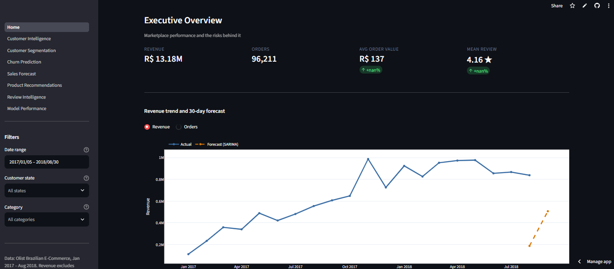

# EcomIQ — AI-Powered E-Commerce Decision Intelligence Platform

End-to-end analytics platform on the [Olist Brazilian E-Commerce dataset](https://www.kaggle.com/datasets/olistbr/brazilian-ecommerce)
(99,441 orders, Jan 2017 – Aug 2018). Six analytical components — segmentation,
churn prediction, review-score prediction, revenue forecasting, product
recommendation and Portuguese review NLP — served through an 8-page Streamlit
dashboard.

**Live dashboard:** https://ecomiq.streamlit.app



---

## The business problem

97% of Olist's customers never place a second order. The company spends to
acquire a customer, earns commission on one order, and rarely sees them again.
With a limited budget for retention offers and for pressuring underperforming
carriers, the question is: **where should that budget go?**

Every component answers part of it, and every model output ends in an action
someone could take on Monday.

| Question | Component | Decision it supports |
|---|---|---|
| Who are our customers? | Segmentation (K-Means, K=6) | Which groups to treat differently |
| Which are valuable? | Revenue concentration | Whether targeted retention pays |
| Who will churn? | Churn model (logistic, selected on validation) | Whom to contact this week |
| Why? | SHAP | Fix logistics or fix pricing |
| Future sales? | SARIMA forecast | Inventory and staffing |
| What to recommend? | Content-based recommender | Product page and post-purchase email |
| What are they saying? | Sentiment + 7 aspects | Which teams to route problems to |

---

## Headline results

| Component | Metric | Result | Verdict |
|---|---|---|---|
| Review sentiment | F1 (negative class) | **0.876** · ROC-AUC 0.976 | Strong |
| Recommender | recall@10 | **0.222** vs 0.0003 random (734×) | Strong |
| Revenue forecast | MAE, 5-fold backtest | **R$ 4,452** — 13% better than seasonal-naive | Solid at 30 days |
| Review-score prediction | PR-AUC lift | **3.19×** (0.309 vs 0.097 base) · 70.8% precision on the top 1% | Strong |
| Churn / repeat purchase | PR-AUC lift | **1.32×** (0.0213 vs 0.0162 base) | **Weak — reported as such** |

---

## What this project measured and rejected

Most of the value here is in the negative findings. They are all reproducible
from the notebooks.

**Collaborative filtering is infeasible on this data.** 55% of products sold
exactly once, only 3.28% of orders contain two distinct products, and the
user-item matrix is 99.9964% empty. The hybrid weight sweep was monotonic —
every reduction in CF weight improved results, with the optimum at **zero**.
The best hybrid is the content model.

**The churn model is weak, and the logistic baseline actually WON.** Selecting
on validation (not test) picked logistic regression over Random Forest and
XGBoost. PR-AUC lift 1.32×, ROC-AUC 0.55. When a linear model beats boosted
trees, there is no exploitable non-linear structure. Reported honestly rather
than hidden behind the 98.4% accuracy that "predict everyone churns" achieves.

**The same pipeline gets 3.19× lift on review score.** Identical features and
code, 2.4× the lift — because the base rate is 12.8% rather than 1.8%, and
because delivery lateness causes a bad review within days, whereas whether
someone returns in six months depends on price comparison and need recurrence
that Olist does not record. That contrast is the honest answer to "why is your
churn model weak?": not the algorithm, but that the data holds the outcome and
not the causes.

**Dense embeddings lost to sparse TF-IDF.** SVD to 300 dimensions scored F1
0.845 versus 0.876 for plain TF-IDF. On 9-word documents, exact words beat
latent topics.

**ML lag models lost to repeating last week's numbers.** Ridge with lag and
rolling features scored 58% *worse* than seasonal naive. Recursive multi-step
forecasting compounds its own error across 30 steps.

**No LSTM and no transformer.** 606 daily observations cannot support an LSTM.
Sentiment ROC-AUC is already 0.976, leaving ~2 points of headroom against
2.5GB of dependencies. Both decisions are documented, not skipped silently.

---

## Data problems found and fixed

| Problem | Effect if ignored | Fix |
|---|---|---|
| `customer_id` is order-scoped, not person-scoped | Repeat rate reads as exactly 0% | Group by `customer_unique_id` |
| 1,063 "repeat" customers ordered again within 24h across multiple sellers | Repeat rate inflated 3.04% → true 1.92% | 7-day basket-split guard |
| Series is right-censored: last 10 days fall from ~30k to 1.5k | SARIMA read the cliff as trend and **forecast negative revenue** | `trim_incomplete_tail()` |
| 789 `review_id` values reused across different orders | Duplicate rows on every review join | Key reviews by `order_id` |
| Monthly late rate swings 1.4% → 21.4% | Model learns a time trend, reports it as a delivery effect | Order-month controls |
| Split orders are late *less* often but score 1.3★ worse | `is_late` understates reality for multi-seller orders | `is_split_order` flag |
| 775 orders have no line items | Unguarded division yields `inf`, poisoning every mean | Guarded denominators |
| Reviews anonymised with Game of Thrones house names | "lannister" (1,208×) becomes a top model feature | Added to stopwords |

---

## Key findings

**Late delivery is a cliff, not a slope.** Mean review score by delivery
against the promised date:

| vs promise | Mean score | 1-star rate |
|---|---|---|
| 0–5 days early | 4.15 ★ | 7.7% |
| 1–3 days late | 3.77 ★ | 13.8% |
| **3–7 days late** | **2.32 ★** | **53.0%** |
| 7+ days late | 1.73 ★ | 68.7% |

Pearson r is only −0.27 *because* the relationship is a step function — which
is the argument for threshold features over raw day counts.

**Missing items hurt more than late delivery.** The `completeness` aspect
averages **1.71★** with 77.5% one-or-two star, nearly two stars below the
corpus average. It appears in only 8.3% of comments, so it is invisible in
aggregate metrics — and it does not show up in delivery KPIs at all.

**Revenue is concentrated despite almost no repeat purchasing.** Gini 0.521,
top decile holds 41% of revenue. High-value customers are identifiable from a
*single* order.

**Six segments, and only one is a marketing problem.**

| Segment | % customers | % revenue | Signature |
|---|---|---|---|
| High-value installment buyers | 18.5% | **45.8%** | R$ 239 median, freight ratio 0.11, 7 installments |
| Satisfied mainstream | 45.7% | 31.2% | 9-day delivery, 4.65★ |
| Delivery failures (at risk) | 12.3% | 11.9% | **21.8-day delivery, 1.71★** |
| Repeat / multi-item buyers | 3.0% | 5.5% | 2.11 orders — the only genuine repeaters |
| Low-value, freight-burdened | 18.8% | 3.6% | freight = 60% of order value |
| Never delivered | 1.7% | 2.0% | no delivery date on record |

---

## Architecture

See [docs/architecture.md](docs/architecture.md).

```
src/data → src/features → src/models → src/inference → app/
```

Reusable logic lives in `src/`; notebooks import from it and never the reverse.
Grain is explicit in every function name, thresholds travel with their models,
and there is **no random train/test split anywhere** — every target is a future
event or sits in a time-ordered stream.

---

## Setup

Requires **Python 3.11 or 3.12** (ML wheels lag newer releases).

```powershell
py -3.12 -m venv .venv
Set-ExecutionPolicy -ExecutionPolicy RemoteSigned -Scope CurrentUser
.\.venv\Scripts\Activate.ps1
python -m pip install --upgrade pip
pip install -r requirements.txt
```

```bash
python3 -m venv .venv && source .venv/bin/activate
pip install -r requirements.txt
```

Download the [Olist dataset](https://www.kaggle.com/datasets/olistbr/brazilian-ecommerce)
and unzip all 9 CSVs into `data/raw/`, then verify:

```bash
python scripts/check_env.py
```

## Running it

Notebooks are `.py` files with `# %%` cell markers — open in VS Code and use
"Run Cell", or run them as plain scripts. Order matters:

```bash
python notebooks/01_eda.py            # 20 analyses, 8 sections
python notebooks/02_features.py       # two feature tables + splits
python notebooks/03_segmentation.py   # K-means + PCA
python notebooks/04_churn_model.py    # 3 models, validation selection, SHAP
python notebooks/04b_review_model.py  # second target on the same pipeline
python notebooks/05_forecast.py       # baselines + SARIMA + backtest
python notebooks/06_recommender.py    # content vs CF vs hybrid
python notebooks/07_review_nlp.py     # sentiment + aspects
python scripts/build_dashboard_data.py
streamlit run app/Home.py
```

Tests:

```bash
pytest tests/ -q          # 51 tests
```

Programmatic scoring:

```python
from src.inference.pipeline import EcomIQPipeline

pipe = EcomIQPipeline()
pipe.health_check()                      # which artifacts exist
pipe.score_churn(orders, budget_pct=5)   # adds repeat_proba + contact_flag
pipe.forecast_revenue(days=30)           # with 80% intervals
pipe.recommend("product_id", k=10)
pipe.score_sentiment(["não recebi o produto"])
```

---

## Dashboard

Eight pages, grouped by who asks the question rather than by which model
produced the answer.

| Page | Answers |
|---|---|
| Executive Overview | How is the business doing, and what is at risk? |
| Customer Intelligence | Is targeted retention viable at all? |
| Customer Segmentation | Which groups do we treat differently? |
| Churn Prediction | Who do we contact this week, and does it pay? |
| Sales Forecast | How much do we stock and staff? |
| Product Recommendations | What goes in the "similar items" slot? |
| Review Intelligence | What is breaking, and who owns it? |
| Model Performance | Should we trust any of this? |

Filters persist across pages via `st.session_state`. The churn page has live
campaign-ROI sliders and exports a targeting list. The Model Performance page
leads with the weak models and states why.

---

## Project structure

```
├── app/                    Streamlit: _shared.py + Home.py + 7 pages
├── data/
│   ├── raw/                9 Olist CSVs (gitignored)
│   └── processed/          feature tables, predictions, dashboard artifacts
├── docs/architecture.md
├── models/                 trained artifacts (.joblib)
├── notebooks/              01–07 + 04b, .py with # %% cells
├── reports/figures/        30+ charts
├── scripts/                check_env.py, build_dashboard_data.py
├── src/
│   ├── config.py           paths, seed, analysis window, repeat-gap rule
│   ├── data/               schema, load, prepare
│   ├── features/           targets, splits, leakage guard
│   ├── models/             churn, review, forecast, recommend, sentiment
│   ├── inference/          serving pipeline
│   └── viz/                shared plot style
└── tests/                  51 pytest tests
```

---

## Tech stack

pandas · numpy · scikit-learn · XGBoost · SHAP · statsmodels · Streamlit ·
Plotly · pytest

Deliberately excluded: Prophet (fragile install, hides the concepts),
LightGBM (near-substitute for XGBoost), SMOTE (class weights plus threshold
tuning is the real lever), spaCy and NLTK (9-word Portuguese comments do not
need a dependency parser; stopwords are hardcoded so a fresh clone works
offline), and word clouds (no quantitative encoding).

---

## Limitations

- **Churn model has 1.32× lift.** Useful for narrow targeting (top 1%, where
  lift reaches 2.7×), not for identifying at-risk customers at scale. Model
  selection happens on validation, so the reported test metrics are unbiased —
  note that validation and test disagreed on the winner, which is exactly the
  bias a held-out selection set exists to prevent.
- **No confidence intervals yet.** The churn test set has 185 positives, so a
  1.32× lift should be read with that in mind. Bootstrap CIs are the next
  planned addition.
- **Segmentation silhouette is ~0.21** across K=4 to K=8. Structure is weak and
  overlapping, as expected when 98% of customers order once. Segments are
  useful groupings, not hard boundaries.
- **90-day forecast intervals cross zero.** Twenty months of history cannot pin
  down a quarter. Use the 30-day number for decisions.
- **No "new customer" segment exists.** Median recency is 201–272 days across
  every cluster because the dataset ends. `recency_days` has a PC1 loading of
  0.003.
- **Sentiment measures complaint themes, not satisfaction.** 76.6% of 1-star
  reviewers write text versus 35.9% of 5-star, so the corpus over-represents
  negatives ~2×.
- **Annual seasonality cannot be validated** — only one instance is observed.

---

## Data licence

Olist released this data publicly on Kaggle. Check the licence field on the
[dataset page](https://www.kaggle.com/datasets/olistbr/brazilian-ecommerce)
before any commercial use. The data is anonymised, and partner names were
replaced with Game of Thrones house names by the publisher. Attribute Olist and
do not attempt re-identification.
